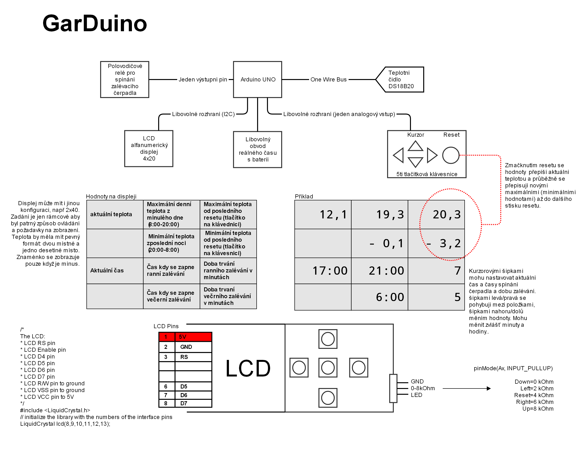

= Garduino

Garduino je zařízení, které zajišťuje automatické zalévání zahrady prostřednictvím spínacího relé, udržování informací o aktuálním času, teplotě a extrémních teplot z posledního období. Zařízení se skládá z malého jednodeskového počítače Arduino UNO ke kterému je připojeno pomocí 1-Wire sběrnice teplotní čidlo, pomocí I2C sběrnice LCD 40x2 displej. Měření času je řešeno pomocí RTC DS1302, nastavování hodnot pomocí pěti spínačů, které do obvodu zapojují různé velikosti odporu a Arduino podle velikosti napětí vyhodnotí, který spínač byl stištěn. V době dosažení konkrétního času zalévání je vyslán spouštěcí impuls do časového relé a po příslušné době další impuls, který relé opět vypne.  

== Zadání úlohy

== Ukázka ovládání

video::XeAI03Mpdd8[youtube]

https://www.youtube.com/watch?v=XeAI03Mpdd8[Youtube video, *ukázka ovládání*]

== Základní struktura

Program se skládá ze 3 částí:

== gardperif

Tento modul obsahuje konstanty, globální proměnné a funkce, pomocí kterých je přistupováno k jednotlivým zařízením (teplotní čidlo, LCD displej, obvod reálného času, klávesnice, spínací relé)

[source,c++]
----
const int butConst[2][6] = { {325, 494, 529, 0, 437, 8}, {'l', 'r', 'u', 'd', 's', '-'} };
----
Klávesnice je realizována pěti spínači, které připojují do obvodu různé odpory a tím regulují výstupní napětí. Toto napětí přivedené na analogový vstup Arduina je pomocí funkce 'analogRead' přečteno jako konstanty uvedené v tomto poli. Poslední položka `[8, '-']` představuje absolutní toleranci naměřené hodnoty (325 +/- 8 apod.) a znak, který bude vracet funkce 'getBut()' pokud žádná klávesa stisknuta nebude.

[source,c++]
----
const int buttonPin = A0;
----

Pin na kterém bude čten analogový výstup klávesnice.

[source,c++]
----
const int temperatPin = 7;
----

Pin, na kterém budou čteny hodnoty teplotního čidla.

[source,c++]
----
const int relayImpulsPin = A1;
----

Pin, který bude vysílat impuls pro zapnutí/vypnutí spínacího relé, viz. funkce 'impulseRelay()'. 

[source,c++]
----
extern unsigned long lastPress;
----

Konstanta, ve které bude udržován čas posledního stisku tlačítka, viz. funkce 'getBut()'. 

[source,c++]
----
extern unsigned long lastRelayImpuls;
----

Globální konstanta udržuje čas, kdy byl vyslán poslední impuls do spínacího relé. V modulu 'Garduino.ino' použito k zjištění, zda je již čas ukončit zalévání.

[source,c++]
----
extern OneWire dst;
----

Knihovna 'OneWire' poskytuje třídu, pro komunikaci se zařízením pomocí „1-Wire Protocolu“ -> v Garduinu použito pro komunikaci s teplotním čidlem.

[source,c++]
----
extern DS1302 rtc;    
----

Objekt třídy 'DS1302', kterou poskytuje stejnojmenná třída pro komunikaci s RTC (real time clock) - obvodem reálného času. V souboru 'cpp' je inicializován označením 3 pinů, kterými je propojen s Arduinem (8, 9 a 10).

[source,c++]
----
void initPerifs();
----

Funkce, která inicializuje periferie:
- připraví RTC
- načte adresu pro komunikaci s teplotním čidlem
- nastaví na vstup pin klávesnice a na výstup pin ovládající spouštěcí relé

[source,c++]
----
char getBut();
----

Vyhodnotí, které tlačítko je stištěno. Výstupem jsou hodnoty `butConst` -> 'l', 'r', 'u', 'd', 's', '-'

[source,c++]
----
boolean noPressBut();
----

Pokud není stištěno tlačítko, vrátí 'True', jinak 'False'.

[source,c++]
----
void prepareTemperature();
float getTemperature();
----

První funkce zaúkoluje teplotní čidlo k získání hodnoty. Na přesunutí hodnoty do 'scratchpadu' je třeba vyčkat necelou sekundu. Než se zavolá funkce `getTemperature()` je možné pokračovat  v obsluze klávesnice.

[source,c++]
----
void getTimeRTC(int &h, int &m, int &di, int &ni);
----
Funkce nastaví 4 proměnné, které se týkají reálného času:
- h, m -> aktuální hodina, minuta
- di, ni -> jednoznačné hodnoty, které identifikují období dne (8:00 - 20:00) a následující období noci (20:00 - 8:00). Pokud dojde ke změně hodnoty, modul 'Garduino.ino' identifikuje například konec dne a nutnost zápisu maximální naměřené teploty na LCD.

[source,c++]
----
char *form2digit(int num);
----

Jen pomocná funkce pro tisk dvouciferného čísla.

[source,c++]
----
void impulseRelay();
----
Funkce pro vyslání impulsu do spínacího relé. Impuls je nastaven na 1 sekundu, aby byl snadno testovatelný pomocí diody. Zároveň dojde k nastavení globální konstanty 'lastRelayImpuls'

== lcdobject

Tento modul obsahuje konstanty, globální proměnné a funkce, pomocí kterých je řízen výstup na LCD displej. 

[source,c++]
----
const int durationCursor = 10;
----

Při stisku klávesy se objeví na LCD kurzor, kterým lze pohybovat (focus mod). Konstanta udržuje čas, po kterém je focus mod ukončen, pokud uživatel přestane používat klávesnici.

[source,c++]
----
extern LiquidCrystal lcd;
----

Objekt, který představuje LCD displej, jeho inicializace je v souboru 'cpp' pomocí konstruktoru s označením pinů, které jsou k ovládání využity '(12, 11, 5, 4, 3, 13)'.

[source,c++]
----
const int infval = 60000;
----
Viditelné objekty na displeji mohou být ve stavu bez hodnoty. Tato pomocná hodnota slouží pro snadný přechod do tohoto stavu (viz. např. funkce `setInt`) nebo k oznámení, že jsou v tomto stavu (viz. např. funkce `getHour`)

[source,c++]
----
enum GarduinoObjects { tpresentTemperature, tmaxDTemperature, tmaxRTemperature, 
                       tminNTemperature, tminRTemperature, tpresentTime, tmorningTime, 
                       tmorningDuration, teveningTime, teveningDuration};
----
Každý objekt je schopen se „představit“ pomocí hodnot tohoto enum-typu. Díky tomu lze nastavit jejich zvláštní chování v metodě `lcdObject *focusProcess()` nebo v základní smyčce souboru 'Garduino.ino'
  
[source,c++]
----
lcdObject::x, lcdObject::y
----
Pozice konkrétního lcdObjectu na displeji.

[source,c++]
----
static lcdObject::ax, lcdObject::ay
----
Statické proměnné, které udržují souřadnice objektu, na který je zaměřen focus.

  // visibility of cursor -> 'n' -> no cursor, 'c' -> cursor, 'b' -> blink 
[source,c++]
----
static char lcdObject::visCursor;
----

Statická proměnná, která udržuje stav kurzoru 'n' -> není vidět, 'c' -> kursor je vidět, 'b' -> bliká. Podle této proměnné statická metoda `lcdObject::ShowCursor()` zobrazuje nebo schovává kurzor.
  
[source,c++]
----
char format;
----

Proměnná udržuje informaci o formátu daného objektu ('t' -> čas, 'd' -> celé číslo, 'f' -> desetinné číslo)

[source,c++]
----
bool isBlinking;
----

Je nastaven stav blikání? Pokud 'true' pak metoda `void lcdObject::showData()` každou sudou sekundu schová zobrazení dat. Použito v hlavní smyčce pro zdůraznění, že právě probíhá zalévání.

[source,c++]
----
bool isEmpty;
----
True pokud je objekt ve stavu bez hodnoty.

[source,c++]
----
lcdObject *l, *r, *u, *d;
----

Každý objekt udržuje ukazatele na své sousedy, aby šlo snadno přenášet focus při stisku konkrétní klávesy.

[source,c++]
----
int hour, min, dnum;
float fnum;
----

Udržují naměřenou hodnotu daného objektu.

[source,c++]
----
//setting two-digits on the position [x,y]
int lcdSetDigit (int x, int y, int maxd1, int maxd2);

//setting time on the position [x,y]
void lcdSetTime (int x, int y, int &h, int &m);
----

Metody pro editaci konkrétního objektu - buď ve formátu celého čísla, nebo času. Tyto metody jsou volány při přechodu do editačního modu z funkce 'focusProcess()'.

[source,c++]
----
GarduinoObjects me; 
----

O jaký objekt se konkrétně jedná - viz. typ enum 'GarduinoObjects'.
  
[source,c++]
----
  // state == 'f' => focus; 'v' => only visible; 'r' => edit
  char state;
----
Atribut udržuje stav, ve kterém se momentálně nachází ('f' -> je zameřen, bliká u něho kurzor, 'v' -> vidět je pouze kurzor, nikoliv objekt samotný, 'r' -> uživatel právě edituje hodnotu)
  
[source,c++]
----
  lcdObject(GarduinoObjects tme, int x, int y, char format);
----
Základní konstruktor objektu - použit při inicializaci v souboru 'Garduino.ino'.

[source,c++]
----
bool lcdObject::setTime(int h, int m)
----

Metoda nastavuje hodnotu času, nebo přechází do stavu „bez hodnoty“, pokud je `h == infval`. Pokud jsou zadány nesmyslné hodnoty, vrátí `false`.

[source,c++]
----
bool lcdObject::isEqualTime(lcdObject &anotherTime)
----

Vrátí `true` pokud objekt `anotherTime` obsahuje stejný čas. Použito v 'Garduino.ino' pro zjištění, kdy se má vyslat impuls do spínacího relé.

[source,c++]
----
void lcdObject::setInt(int dn)
void lcdObject::setFl(float fn)
float lcdObject::getFl()
int lcdObject::getHour()
int lcdObject::getMin()
bool lcdObject::getIsEmpty()
int lcdObject::getInt()
----

Běžné gettery a settery o naměřených hodnotách a stavech. Nastavují nebo vrací bezhodnotový stav pomocí konstanty `infval`.

[source,c++]
----
void lcdObject::showData()
----
Podle formátu se zobrazí na pozici [x, y] čas nebo číselná hodnota. Bezstavový stav je zde natvrdo zobrazen pomocí pomlček.

[source,c++]
----
void lcdObject::setFocus()
void lcdObject::setEdit()
void lcdObject::setNormal()
----
Nastaví daný objekt do stavu zaměření/editace/bez zaměření (postará se o zobrazení kurzoru a aktualizuje společné statické proměnné `ax, ay`).

[source,c++]
----
void lcdObject::setNeighb(lcdObject *tl,lcdObject *tr,lcdObject *tu,lcdObject *td)
----
Setter pro nastavení sousedů na displeji.

[source,c++]
----
lcdObject *focusProcess();
----
Metoda, která je volána z hlavní smyčky 'Garduino.ino' pro objekt, na kterém je momentálně zaměření. Metoda se podle stavu (proměnná `state`) stará o správné chování objektů, zajišťuje přechod mezi těmito stavy, nastavení nových hodnot a vrací objekt na který přechází 'focus' při dalším průběhu hlavní smyčky.

== Garduino

Soubor se základní smyčkou celého programu, inicializací všech lcd-objektů a provázání jejich vzájemné spolupráce.

[source,c++]
----
float todayMaxTemp, todayMinTemp;
----

Dnešní maximální a minimální teplota.

[source,c++]
----
float temperNow;
----

Momentální naměřená teplota.

[source,c++]
----
int lastRecNight, lastRecDay;
----

Která noc/který den byl naposled zaznamenán. Používá se hodnota `di` a `ni` - viz. funkce `void getTimeRTC(int &h, int &m, int &di, int &ni)`

[source,c++]
----
const int deltime = 200;
----
Konstanta představující počet milisekund po každém průběhu hlavního cyklu. Regulací lze určovat citlivost reakce na klávesové ovládání kurzoru.

[source,c++]
----
int loopcounting = 0;
----

Proměnná udržuje počet průběhů hlavní smyčky od posledního volání `float getTemperature()`, která by se měla volat nejdříve po necelé sekundě.

[source,c++]
----
bool morningWateringON = false;
bool eveningWateringON = false;
----

Probíhá právě ranní/večerní zalévání? “Ranní„ zalévání se nezapne, pokud momentálně probíhá „večerní“ a naopak.

[source,c++]
----
lcdObject *fObj;
----
Objekt na kterém je právě 'focus'.

[source,c++]
----
const int nlcdobj = 10;
lcdObject* arrayobj[nlcdobj];
----
Všech deset objektů bylo pro snadnější manipulaci shrnuto do pole... nakonec použito jen v `showAllInfo()` O:)

[source,c++]
----
void showAllInfo()
----
Zobrazit všechny objekty na lcd-displej.
